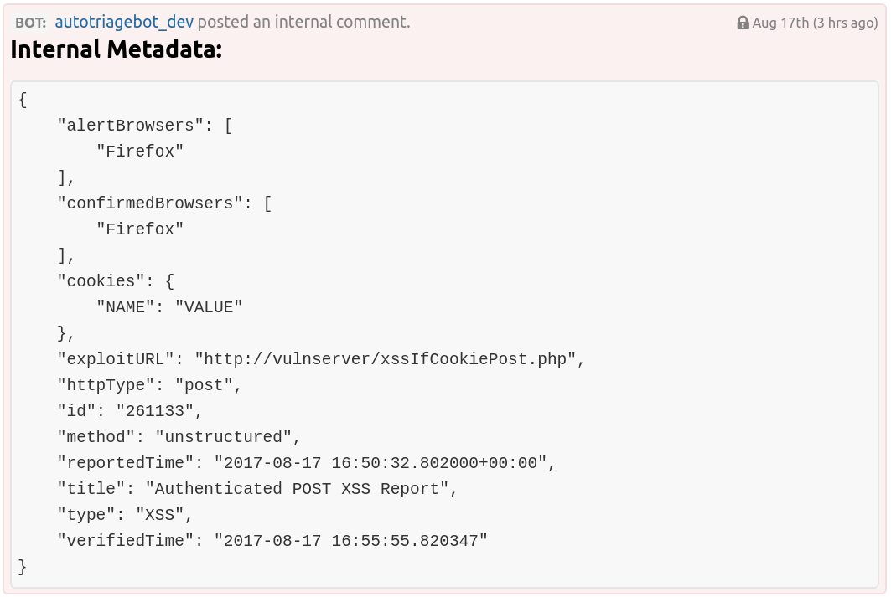

This config file should be placed in `AutoTriageBot/config.py`. 

### HackerOne: 

First we'll need to set the HackerOne config options: 

```python
apiName = "<HackerOne Bot Name>"
programName = "<HackerOne Program Name>"
```

- `apiName` should be set to the "Identifier" associated with the API key in HackerOne's API Settings page. 
- `programName` should be set to the name of the program. This is the path used to access your HackerOne page (e.g. if your page is at `https://hackerone.com/example` then `programName` shoul be set to `example`). 

### Slack:

AutoTriageBot supports posting messages to a predefined Slack channel whenever reports are verified. 

```python
channel = "#<Slack Channel>"
```

Note that the slack channel name must start with the `#` (e.g. `channel = "#AutoTriageBot"`). 

To disable the slack integration, simply set `channel` to `False`:

```python
channel = False
```

### Payout Suggestions

AutoTriageBot supports suggesting payouts for reports based off of the vulnerability type and the domain in question. When enabled, it posts internal comments with the average bounty and the standard deviation for that report. In order to enable this, you'll have to fill out the payoutDB structure:

```python
from AutoTriageBot.DataTypes import BountyInfo
payoutDB = {'xss': {'DomainName1': BountyInfo(average=0, std=0),
                    'DomainName2': BountyInfo(average=0, std=0),
                    'average': BountyInfo(average=0, std=0)},
            'open redirect': {'DomainName1': BountyInfo(average=0, std=0),
                              'DomainName2': BountyInfo(average=0, std=0),
                              'average': BountyInfo(average=0, std=0)},
            'sqli': {'DomainName1': BountyInfo(average=0, std=0),
                     'DomainName2': BountyInfo(average=0, std=0),
                     'average': BountyInfo(average=0, std=0)}}
```

To disable payout suggestions, simply set `payoutDB` to `False`: 

```python
payoutDB = False
```

### Hostname Sanitization

Oftentimes vulnerabilities on different subdomains should be treated as the same subdomain for the purposes of duplicate detection (e.g. `lb1.example.com` and `lb2.example.com` are likely running the same code, so a report about `lb1` may be a duplicate of a report about `lb2`). AutoTriageBot supports this via replacing hostnames matching regexes with arbitrary strings. This is configured via a dictionary like so: 

```python
hostnameSanitizers = {r'.*\.lb\.example\.com': '[lb].example.com',
                      r'vpn.*\.example\.com': '[vpn].example.com'}
```

To disable hostname sanitization, simply set `hostnameSanitizers` to `False`:

```python
hostnameSanitizers = False
```

### Whitelisting Domains

In order to configure the domains that AutoTriageBot will test vulnerabilities against, you'll need to provide a whitelist of acceptable endings for domains: 

```python
domains = ['example.com', 'example.org', 'dev.example']
```

If you want to allow AutoTriageBot to run against arbitrary domains, set `domains` to `[]`:

```python
domains = []
```

### Whitelisting Usernames

If you want to have the bot only reply to a certain set of HackerOne reporters, you can provide a set of whitelisted usernames to run the bot against: 

```python
whitelistedUsernames = ['user1', 'user2']
```

To disable whitelisting of usernames, simple set `whitelistedUsernames` to `False`:

```python
whitelistedUsernames = False
```

### Blacklisting Usernames

If you want to have the bot never reply to a certain set of HackerOne reporters, you can provide a set of blacklisted usernames that the bot should never interact with: 

```python
blacklistedUsernames = ['user1', 'user2']
```

To disable blacklisting of usernames, simple set `blacklistedUsernames` to `False`:

```python
blacklistedUsernames = False
```

### Genesis Date

When first enabling the bot, it is likely a good idea to have it only reply to reports since it was initially started. To configure this, you can set a genesis date where the bot will only process reports after that date:

```python
import datetime
genesis = datetime.datetime(2017, 1, 1, tzinfo=datetime.timezone.utc)
```

To disable this, simply set `genesis` to `False`:

```python
genesis = False
```

### Debugging

To enable debugging information, there are two boolean options: `DEBUG` and `DEBUGVERBOSE`. Note that `DEBUGVERBOSE` does not imply `DEBUG`. 

```python
DEBUG = True
DEBUGVERBOSE = True
```

To disable debugging information, set them both to `False`:

```python
DEBUG = False
DEBUGVERBOSE = False
```

Note that it is generally recommended to keep debugging information enabled. 

### Metadata Logging

AutoTriageBot supports logging metadata in the form of an internal comment: 



To enable this feature, set `metadataLogging` to `True`:

```python
metadataLogging = True
```

To disable this feature, set `metadataLogging` to `False`:

```python
metadataLogging = False
```

### Triage on Reproduction

In order to have AutoTriageBot mark reports as Triaged, set:

```python
triageOnReproduce = True
```

To disable marking reports as Triaged, set `triageOnReproduce` to `False`:

```python
triageOnReproduce = False
```

### Allowed Failures

If you want AutoTriageBot to automatically stop interacting with researchers that have failed to interact with it in the past, ```allowedFailures``` allows you to set a maximum number of failed conversations before the bot will automatically blacklist a user. For example, if ```allowedFailures = 3``` after 3 failed interactions between ```ReporterName``` and AutoTriageBot, the bot will stop interacting with ```ReporterName```. 

```python
allowedFailures = 3
```

To disable automatic blacklisting of users, set ```allowedFailures``` to ```False```:

```python
allowedFailures = False
```

### Misc. Options

You can configure the stop phrase: 

```python
stopPhrase = "STOP TRIAGEBOT"
```

And the timeout (that is used both as the maximum number of replies and the wait time in the open redirect module):

```python
timeout = 10
```
