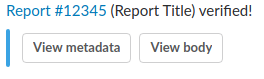

# Slack

AutoTriageBot integrates with Slack for notifications about automatically verified reports. In order to post messages, you'll have to setup a Slack API bot with OAuth. When creating the swarm it will prompt you for the OAuth Access Token and the Verification Token. When AutoTriageBot verifies a report, it will message the configured channel:

From Slack, you can view the metadata (which includes all of the information needed to verify the report) and the body of the original report. 

## Slack Architecture

The Slack OAuth keys are shared with two containers. The `bot` container uses the OAuth keys to post a message whenever a report is verified. The `slack` container runs a flask webserver hosted behind [Caddy](https://caddyserver.com/) that receives webhooks from Slack whenever a button is pressed. It verifies the verification token, then posts an ephemeral message with the requested contents. 

Since the server is hosted over SSL, port 80 and port 443 must be opened to the Slack container. In addition, you must create a Caddyfile as documented in [Config.md](Config.md). 

## Security

The flask webserver double verifies all incoming requests before accessing any sensitive report data. The first step is verifying Slack's built in verification token. The second step verifies that data is only sent to `slack.com` which means that even if an attacker compromises your Slack verification token, they cannot access the reports. 